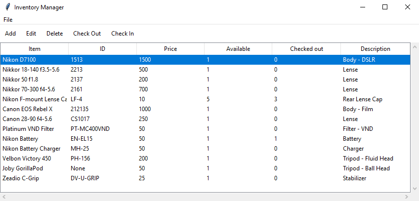

# Inventory Manager
An inventory manager using Python, Tkinter, SQLite, and SQLAlchemy

## Usage
1. Install dependencies
    * Python 3.x
        [Download Python](<https://www.python.org/downloads/>)

    * SQLite
        [Download SQLite](<https://www.sqlite.org/download.html>)

    * SQLAlchemy 
        Run `pip install SQLAlchemy` in terminal or console after installing Python
2. Clone the repository
    `git clone https://github.com/nathanlytang/InventoryManger.git`

## Bugs
* Zero Bug - Use of IntVar in entry widget creates zeroes
* ID sorting - Sorting on ID column unavailable due combination of list and tuple
* Negative Amount - Available and Checked Out can go negative
